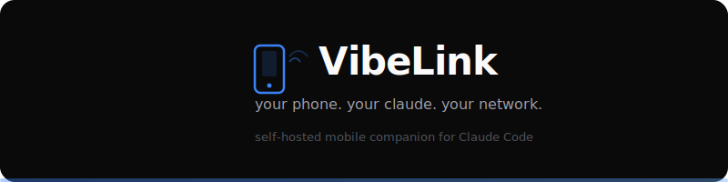

<div align="center">



<br/>

[](LICENSE)
[](https://nodejs.org)
[](https://expo.dev)
[](https://www.typescriptlang.org)

[Quick Start](#quick-start) · [Roadmap](#roadmap) · [Dashboard](#dashboard) · [Contributing](CONTRIBUTING.md)

</div>

---

## What is VibeLink

VibeLink turns your phone into a first-class interface for Claude Code. Instead of hunching over a terminal, you open an app, pick a project, and start chatting. Claude's responses stream to your phone in real time -- markdown, code blocks, tool activity, and dynamic UI components like tables, forms, charts, and file trees.

Everything runs on your machine and your Tailscale network. VibeLink spawns the real Claude Code CLI as a subprocess, so all your existing configuration -- CLAUDE.md files, MCP servers, skills, hooks, settings -- works automatically with zero setup. There's no cloud service, no accounts, no telemetry. Your code and conversations never leave your network.

The project is open source and designed for developers who already use Claude Code and want a mobile-friendly way to interact with it. The Android APK is built locally (no app store required), and the entire codebase is cross-platform TypeScript.

## How VibeLink Compares

**VibeLink** — self-hosted, native mobile app, MIT license, MCP dynamic UI

> **vs Claude Remote Control** — official Anthropic feature. Zero setup (`claude remote-control`), but requires Max/Pro subscription, routes through Anthropic's servers, no custom UI, not self-hosted, not open source.

> **vs OpenClaw** — open source, Docker-based web UI. Not a native mobile app, no MCP integration. Had a WebSocket RCE vulnerability (CVE-2026-25253).

**Only VibeLink has MCP-powered dynamic UI** — Claude can push interactive tables, forms, charts, and custom components directly to your phone. Fully self-hosted, nothing leaves your network.

## Roadmap

### Built

- [x] **Bridge Server** -- Node.js server that spawns Claude CLI subprocesses, manages sessions, streams NDJSON over WebSocket
- [x] **MCP Server** -- registered with Claude Code, provides render_ui, create_tab, update_ui, request_input, send_notification tools
- [x] **Mobile App** -- React Native (Expo) with session list, project picker, chat with streaming responses
- [x] **Chat View** -- messages rendered as markdown with code blocks, tool activity indicators, streaming text
- [x] **Terminal View** -- raw event stream showing exactly what Claude is doing
- [x] **Multi-Session** -- run multiple Claude sessions in different project directories simultaneously
- [x] **Project Discovery** -- auto-scans your filesystem for git repos and CLAUDE.md projects
- [x] **Dashboard** -- localhost web UI for managing sessions and debugging (http://localhost:3400/dashboard)
- [x] **Auth** -- token-based authentication for all connections
- [x] **Per-Session Permissions** -- toggle to skip permissions or run with default Claude safety checks
- [x] **Auto-Reconnect** -- WebSocket reconnects with event replay on disconnect

### In Progress

- [ ] **Permission approval in app** -- approve/deny tool use from your phone instead of skipping all permissions
- [ ] **Keyboard handling** -- input bar stays above keyboard on all Android devices
- [ ] **Streaming polish** -- typing indicator resolves cleanly when Claude finishes
- [ ] **Dynamic UI rendering** -- render_ui components (tables, forms, charts) displayed inline in chat
- [ ] **Setup script testing** -- end-to-end validation of setup.sh for fresh installs

### Planned

- [ ] **Localhost preview** -- see your dev server running on your phone via stream_preview MCP tool
- [ ] **Auto-discovery** -- find the Bridge automatically via mDNS or Tailscale MagicDNS (no manual IP entry)
- [ ] **Voice input** -- talk to Claude from your phone (Whisper STT)
- [ ] **Camera/file uploads** -- send photos and files to Claude
- [ ] **Push notifications** -- get notified when Claude finishes a long task
- [ ] **GitHub integration** -- clone repos directly from the app
- [ ] **iOS build guide** -- contributor documentation for building on Mac

## Architecture

```
Phone (React Native)
  |
  | WebSocket + REST
  | (over Tailscale)
  v
Bridge Server (Node.js)
  |               |
  | stdin/stdout   | Unix socket
  | NDJSON         | IPC
  v               v
Claude CLI     MCP Server
(subprocess)   (render_ui, tabs,
               request_input)
```

## Requirements

- **Node.js 22+** — bridge and MCP server
- **Claude Code CLI** — installed and authenticated
- **Tailscale** — on workstation + phone (same account)
- **Java 17+** — only for building Android APK

## Quick Start

```bash
git clone https://github.com/jd1207/vibelink && cd vibelink
./setup.sh
```

The setup script:
1. Checks prerequisites (claude, node, tailscale)
2. Builds Bridge Server and MCP Server
3. Registers the MCP server with Claude Code
4. Generates auth token in `bridge/.env`
5. Optionally installs a systemd service for always-on access
6. Optionally builds the Android APK
7. Prints your connection info and instructions

## Daily Use

```bash
vibelink start      # start the bridge as a background service
vibelink stop       # graceful shutdown
vibelink status     # check running sessions and connected clients
```

Once the bridge is running, open the app on your phone. No terminal needed for daily use.

## Dashboard

Open **http://localhost:3400/dashboard** in your browser to see:
- Active sessions with process status
- Connected clients
- Embedded chat (synced with your phone)
- Terminal view of raw Claude events
- Session management (end sessions, end all)

## Android Setup

```bash
cd mobile && npm install
npx expo prebuild --platform android
cd android && ./gradlew assembleRelease
```

APK output: `android/app/build/outputs/apk/release/`

Install via USB (`adb install`), QR code over Tailscale, or send the file directly.

## iOS Setup

The codebase is fully cross-platform. iOS builds require a Mac with Xcode:

```bash
cd mobile && npm install
npx expo prebuild --platform ios
npx expo run:ios --device --configuration Release
```

## Security and Privacy

- **Self-hosted**: everything runs on your workstation
- **Tailscale**: E2E encrypted via WireGuard
- **Token auth**: 256-bit token on every request
- **No telemetry**: no analytics, no tracking, no external calls
- **Local APK**: built and signed on your machine

See [SECURITY.md](SECURITY.md) for details.

## Project Structure

```
vibelink/
  bridge/         Bridge Server (Node.js + TypeScript)
  mcp-server/     MCP Server for Claude Code
  mobile/         React Native App (Expo + TypeScript)
  setup.sh        One-command setup script
  vibelink        CLI wrapper (start/stop/status)
```

See package READMEs for internals:
- [bridge/README.md](bridge/README.md)
- [mcp-server/README.md](mcp-server/README.md)
- [mobile/README.md](mobile/README.md)

## Contributing

See [CONTRIBUTING.md](CONTRIBUTING.md) for build instructions and code style.

## License

MIT
